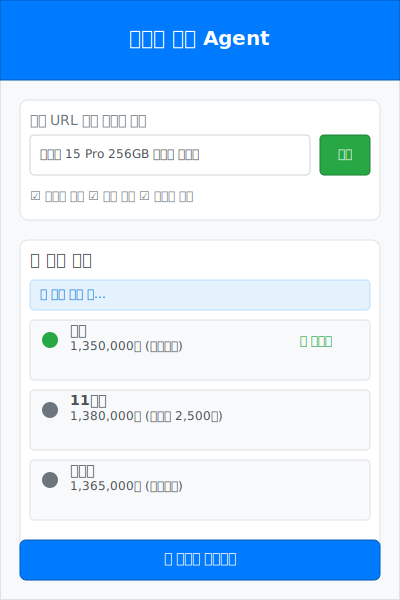
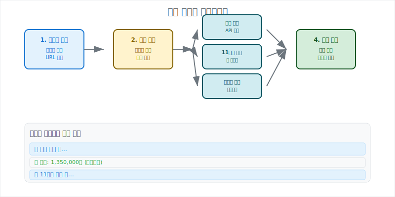
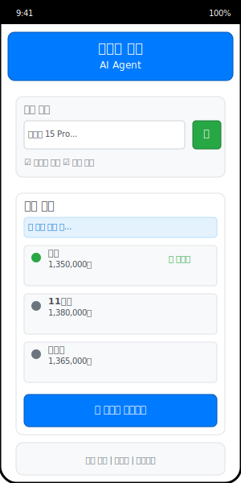

# 최저가 검색 Agent UI/UX 와이어프레임

## 🎯 디자인 목표
- **직관적 사용**: 한 번에 이해할 수 있는 간단한 인터페이스
- **실시간 피드백**: 스트리밍 방식으로 검색 진행상황 시각화
- **모바일 최적화**: 스마트폰에서도 편리한 사용성
- **접근성**: 누구나 쉽게 사용할 수 있는 유니버설 디자인

## 📱 주요 화면 설계

### 1. 메인 인터페이스 (데스크톱)
상품 검색부터 결과 확인까지의 전체 플로우를 한 화면에서 처리



**주요 구성 요소:**
- **헤더**: 브랜드 아이덴티티와 서비스명 표시
- **검색 영역**: URL/상품명 입력 + 검색 옵션 설정
- **결과 영역**: 실시간 스트리밍 결과 + 최저가 하이라이트
- **액션 버튼**: 최저가 구매 링크 제공

### 2. 검색 플로우 다이어그램
병렬 검색과 스트리밍 응답의 기술적 구조 시각화



**핵심 특징:**
- **병렬 처리**: 여러 쇼핑몰 동시 검색으로 속도 향상
- **실시간 스트리밍**: 검색 진행상황을 단계별로 표시
- **사용자 경험**: 기다리는 시간을 흥미롭게 만드는 인터랙션

### 3. 모바일 레이아웃
스마트폰 환경에 최적화된 세로형 레이아웃



**모바일 특화 기능:**
- **세로 스택 결과**: 좁은 화면에 맞춘 카드형 레이아웃
- **터치 최적화**: 충분한 터치 영역과 간격
- **추가 기능**: 음성 입력, 카메라 바코드, 검색 히스토리

## 🎨 디자인 시스템

### 색상 팔레트
- **Primary Blue**: `#007bff` - 메인 브랜딩 및 액션 버튼
- **Success Green**: `#28a745` - 최저가 하이라이트 및 완료 상태
- **Info Blue**: `#1976d2` - 진행 상황 및 정보 표시
- **Neutral Gray**: `#6c757d` - 보조 텍스트 및 테두리
- **Background**: `#f8f9fa` - 배경색 및 카드

### 타이포그래피
- **헤더**: 20px Bold - 브랜드명 및 주요 제목
- **서브헤더**: 16px Bold - 섹션 제목
- **본문**: 12-14px Regular - 일반 텍스트
- **캡션**: 10-11px Regular - 보조 정보

### 컴포넌트

#### 검색 카드
```
┌─────────────────────────────────┐
│ 🔍 상품명 또는 URL 입력          │
│ ┌─────────────────────┐ [검색]  │
│ │ 아이폰 15 Pro...    │         │
│ └─────────────────────┘         │
│ ☑ 배송비 포함  ☑ 할인 적용      │
└─────────────────────────────────┘
```

#### 결과 카드
```
┌─────────────────────────────────┐
│ ● 쿠팡              ⭐ 최저가    │
│   1,350,000원 (무료배송)         │
└─────────────────────────────────┘
```

#### 스트리밍 상태
```
┌─────────────────────────────────┐
│ 🔍 11번가 검색 중...            │
└─────────────────────────────────┘
```

## 🔄 사용자 플로우

### 기본 검색 플로우
1. **입력** → 상품명 또는 URL 입력
2. **옵션 선택** → 배송비/할인 포함 여부 설정
3. **검색 실행** → 검색 버튼 클릭
4. **실시간 피드백** → 각 쇼핑몰별 검색 진행상황 표시
5. **결과 확인** → 가격 비교 결과 및 최저가 확인
6. **구매 액션** → 최저가 사이트로 이동

### 연속 대화 플로우
1. **초기 검색** → 기본 검색 완료
2. **추가 질문** → "프로 모델은 어때?" 등 자연어 질문
3. **맥락 이해** → 이전 검색 결과 기억하여 비교 제공
4. **개선된 결과** → 더 정확하고 개인화된 응답

## 📊 성능 지표

### 사용성 목표
- **첫 결과 표시**: 5초 이내
- **전체 검색 완료**: 30초 이내  
- **모바일 터치 반응**: 100ms 이내
- **접근성 점수**: WCAG 2.1 AA 준수

### 시각적 피드백
- **로딩 인디케이터**: 각 쇼핑몰별 진행 상황
- **상태 아이콘**: ✅ 완료, 🔍 진행중, ❌ 오류
- **결과 하이라이트**: 최저가 강조 표시
- **호버 효과**: 인터랙티브 요소 시각적 피드백

## 🚀 향후 개선 방향

### Phase 1 - MVP
- 기본 검색 인터페이스
- 3개 주요 쇼핑몰 지원
- 데스크톱 위주 반응형 디자인

### Phase 2 - 모바일 최적화
- 네이티브 모바일 앱 느낌의 UI
- 음성 입력 지원
- 푸시 알림 (가격 변동)

### Phase 3 - 개인화
- 검색 히스토리 관리
- 관심 상품 북마크
- 사용자 선호도 학습

### Phase 4 - 고급 기능
- AR 바코드 스캔
- 소셜 공유 기능
- 가격 알림 설정

## 참고 파일
- PRD: [prd.mdc](../cursor/rules/prd.mdc)
- 사용자 시나리오: [user-scenarios.mdc](../cursor/rules/user-scenarios.mdc)
- 문제 정의: [problem-definition.mdc](../cursor/rules/problem-definition.mdc) 